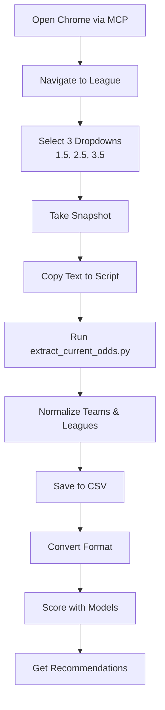

# Norsk Tipping Scraper - Multi-League Support

## Overview

The scraper now supports **multiple European leagues** with automatic team name normalization and league code mapping.

## Supported Leagues

### ✅ Fully Mapped Leagues

| League | Code | Teams Mapped |
|--------|------|--------------|
| **England - Premier League** | E0 | 27 teams |
| **England - Championship** | E1 | 20+ teams |
| **Spain - La Liga** | SP1 | 20 teams |
| **Germany - Bundesliga** | D1 | 18 teams |
| **Italy - Serie A** | I1 | 20 teams |
| **France - Ligue 1** | F1 | 18 teams |

### Additional Supported Leagues
- England League One (E2), League Two (E3)
- Spain Segunda Division (SP2)
- Germany 2. Bundesliga (D2)
- Italy Serie B (I2)
- France Ligue 2 (F2)
- Netherlands Eredivisie (N1)
- Portugal Primeira Liga (P1)
- Belgium First Division A (B1)
- Scotland Premiership (SC0)
- Turkey Super Lig (T1)
- Greece Super League (G1)

## How to Scrape Multiple Leagues

### Step 1: Navigate to League Pages

Using the MCP Chrome DevTools, navigate to each league you want to scrape:

1. **Premier League**: Click "Premier League" button
2. **La Liga**: Navigate to Spain section → Click La Liga
3. **Bundesliga**: Navigate to Germany section → Click Bundesliga
4. **Serie A**: Navigate to Italy section → Click Serie A
5. **Ligue 1**: Navigate to France section → Click Ligue 1

### Step 2: Select Market Dropdowns

For each league page, select the 3 dropdown markets:
- **Totalt antall mål - over/under 1.5**
- **Totalt antall mål - over/under 2.5**
- **Totalt antall mål - over/under 3.5**

### Step 3: Take Snapshot

Use `mcp_io_github_chr_take_snapshot()` to capture the page content.

### Step 4: Extract Data

Copy the snapshot text and add it to `extract_current_odds.py` in the `SNAPSHOT_TEXT` variable. You can combine multiple leagues:

```python
SNAPSHOT_TEXT = """
Lør. 22/11 13:30
Burnley
Chelsea
England - Premier League
TV3+
TOTALT ANTALL MÅL - OVER/UNDER 1.5
Over 1.5
Over 1.5, odds 1.23
...

Lør. 22/11 16:00
Real Madrid
Barcelona  
Spain - La Liga
...
"""
```

### Step 5: Run Extraction

```bash
python extract_current_odds.py
```

This will:
- Normalize all team names (e.g., "Bayern München" → "Bayern Munich")
- Map league names to codes (e.g., "Spain - La Liga" → "SP1")
- Extract all odds for all three lines (1.5, 2.5, 3.5)
- Save to `data/upcoming/norsk_tipping_odds.csv`

### Step 6: Convert and Score

```bash
python convert_norsk_tipping.py
python -m src.upcoming_score --fixtures data/upcoming/norsk_tipping_fixtures.csv
python show_recommendations.py
```

## Team Name Mapping

The scraper automatically normalizes Norwegian/full team names to match the training data format:

### Examples

| Norsk Tipping | football-data.co.uk |
|---------------|---------------------|
| Manchester City | Man City |
| Manchester United | Man United |
| Wolverhampton Wanderers | Wolves |
| Nottingham Forest | Nott'm Forest |
| Brighton and Hove Albion | Brighton |
| Athletic Club | Ath Bilbao |
| Atlético Madrid | Ath Madrid |
| Bayern München | Bayern Munich |
| Paris Saint-Germain | Paris SG |
| AC Milan | Milan |

## Unmapped Teams

If you encounter a team that hasn't been mapped, you'll see a warning:

```
Warning: No mapping found for 'Team Name', using as-is
```

To add the mapping:
1. Open `src/team_mappings.py`
2. Find the correct league dictionary (e.g., `LA_LIGA_TEAMS`)
3. Add the mapping: `"Norwegian Name": "Training Data Name"`

## Workflow Summary



## Tips for Multi-League Scraping

1. **Combine snapshots**: You can paste snapshots from multiple leagues into one `SNAPSHOT_TEXT` variable
2. **Check mappings**: Run extraction once to see which teams need mapping
3. **Update mappings**: Add unmapped teams to `src/team_mappings.py` before converting
4. **League codes**: The conversion script will skip leagues it doesn't recognize
5. **Focus on major leagues**: Premier League, La Liga, Bundesliga, Serie A, and Ligue 1 have the best team mappings

## What We've Accomplished

✅ **MCP Server is Active** - The Chrome DevTools MCP server is running and functional
✅ **Automated Navigation** - Successfully navigated to Norsk Tipping Oddsen  
✅ **Cookie Consent** - Automated clicking "Godta alle" (Accept all cookies)
✅ **League Selection** - Clicked Premier League to view matches
✅ **Match Details** - Expanded a match to view all betting markets
✅ **Odds Extraction** - Successfully extracted Over/Under 2.5 goals odds

## Discovered Workflow

### 1. Initial Page Load

- Navigate to `https://www.norsk-tipping.no/sport/oddsen`
- Wait for cookie consent dialog
- Click `uid=1_10` (Godta alle button)

### 2. Navigate Sports

The main page shows expandable sport categories:

- **Fotball** (394 matches)
- **Ishockey** (17 matches)
- **Håndball** (17 matches)
- **Tennis**, **Golf**, **Alpint**, etc.

Each category can be expanded to show leagues/countries.

### 3. View League Matches

Clicking a league (e.g., "Premier League" button) navigates to a URL like:

```
https://www.norsk-tipping.no/sport/oddsen/sportsbook/event-group/66772.1
```

This page shows:

- Match list with date/time
- Home/Draw/Away odds
- Market selector dropdown (HUB, Totals, Handicaps, etc.)
- "+XXX" buttons to view all markets for that match

### 4. Extract Match Data

Each match row contains:

- **Date/Time**: "Lør. 22/11 13:30"
- **Teams**: "Burnley" vs "Chelsea"
- **League**: "England - Premier League"
- **Basic Odds**: Home/Draw/Away buttons with odds
- **Expand Button**: "+142" (number = total available markets)

### 5. View Full Market Details

Clicking the "+XXX" button navigates to the match detail page:

```
https://www.norsk-tipping.no/sport/oddsen/sportsbook/event/7776712.1
```

This page shows ALL available markets including:

#### Over/Under Markets

- **Totalt antall mål - Over/Under 0.5**
- **Totalt antall mål - Over/Under 1.5**
- **Totalt antall mål - Over/Under 2.5** ⭐ (Our target!)
  - Over 2.5: odds 1.75
  - Under 2.5: odds 2.00
- **Totalt antall mål - Over/Under 3.5**
- **Totalt antall mål - Over/Under 4.5**
- **Totalt antall mål - Over/Under 5.5**

#### Other Markets

- HUB (Home/Draw/Away)
- Handikap 3-veis (3-way Handicap at various levels)
- Begge lag scorer (Both teams to score)
- 1. omgang markets (First half markets)
- And many more...

### 6. Element UIDs for Automation

Example from Burnley vs Chelsea match:

| Element          | UID     | Description            |
| ---------------- | ------- | ---------------------- |
| Over 2.5 button  | `6_98`  | "Over 2.5, odds 1.75"  |
| Under 2.5 button | `6_99`  | "Under 2.5, odds 2.00" |
| Over 3.5 button  | `6_103` | "Over 3.5, odds 2.90"  |
| Under 3.5 button | `6_104` | "Under 3.5, odds 1.38" |

**Note:** UIDs change on each page load, so you need to:

1. Take a snapshot with `take_snapshot()`
2. Parse the text to find the desired element
3. Extract its UID
4. Click or read the element

## MCP Tools Available

The Chrome DevTools MCP provides these tools:

### Navigation

- `navigate_page()` - Load URLs
- `take_snapshot()` - Get accessible DOM tree with UIDs
- `list_pages()` - See open browser tabs

### Interaction

- `click()` - Click elements by UID
- `fill()` - Type into input fields
- `hover()` - Hover over elements
- `wait_for()` - Wait for text to appear

### Data Extraction

- `take_screenshot()` - Capture visual screenshot
- `evaluate_script()` - Run JavaScript in page context
- `get_network_request()` - Inspect network traffic

## Implementation Strategy

To build the full scraper, you have two options:

### Option A: Python + MCP Client

Create a Python MCP client that calls the Chrome DevTools MCP server to:

1. Navigate pages
2. Click elements
3. Extract odds data
4. Parse into structured format

### Option B: Direct Selenium/Playwright

Since you now know the exact workflow, you could also implement this with standard browser automation:

- Use Selenium or Playwright
- Follow the same click sequence
- Extract odds from the expanded match pages

## Next Steps

The scraper skeleton is in `src/norsk_tipping_scraper.py`. To complete it:

1. **Install MCP Python client** (if using MCP approach)
2. **Implement the workflow** using the discovered element patterns
3. **Parse odds data** from snapshot text or via JavaScript evaluation
4. **Handle pagination** if leagues have multiple pages
5. **Add error handling** for missing odds or page load failures
6. **Schedule regular runs** to keep odds updated

## Sample Data Structure

```python
{
    "date": "2025-11-22",
    "time": "13:30",
    "home_team": "Burnley",
    "away_team": "Chelsea",
    "league": "England - Premier League",
    "over_2_5": 1.75,
    "under_2_5": 2.00,
    "url": "https://www.norsk-tipping.no/sport/oddsen/sportsbook/event/7776712.1"
}
```

This matches your existing pipeline which expects `best_over_odds` and `best_under_odds` columns!
